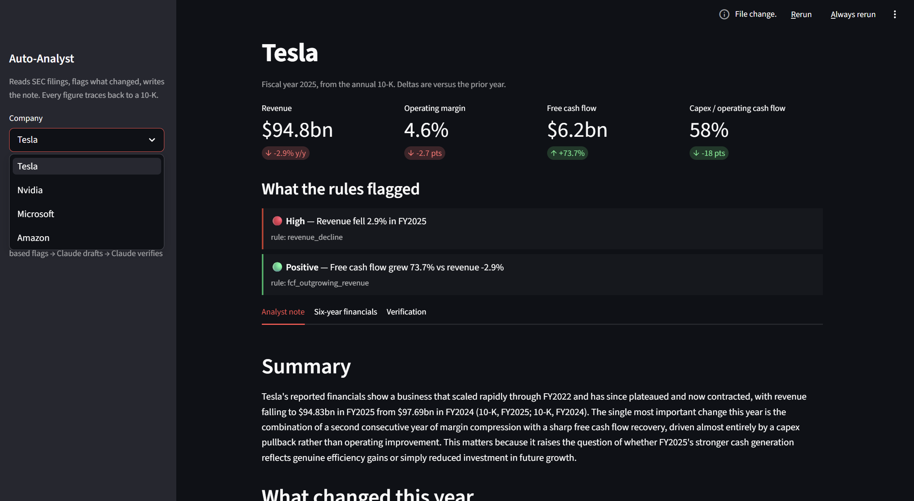

# Auto-Analyst

An AI research agent that reads SEC filings, flags what changed, and writes an investment-committee-style note — with every figure traceable to a 10-K.



Built to answer a specific question: can an LLM produce equity-research output that a professional would trust? The answer here is "only if the model isn't allowed to invent numbers." So the numbers come from filings, the ratios are computed in code, the red flags are rule-based, and the model's job is to reason and write. A second model call then audits the note against the source data before anyone reads it.

Currently covers Tesla, Nvidia, Microsoft and Amazon using six years of annual 10-K data.

## What it produces

For each company, a one-page view with:

- Headline metrics with year-on-year change (revenue, operating margin, free cash flow, capex intensity)
- Rule-based signals, ordered by severity, each showing the rule that fired
- A structured analyst note: summary, what changed, cross-checks between conflicting metrics, questions for management, data limitations
- A verification verdict from an independent fact-checking pass

Example of the kind of insight it surfaces unprompted (Tesla, FY2025): free cash flow rose 74% while revenue fell 2.9% — but operating cash flow was flat, so the improvement came entirely from a $2.8bn capex cut rather than better unit economics. The note tells the reader not to treat the FCF flag as evidence of strength.

## How it works

```
SEC EDGAR XBRL  →  normalise tags  →  compute ratios  →  rule-based flags  →  Claude drafts note  →  Claude verifies figures  →  Streamlit UI
```

| Stage | File | What it does |
|---|---|---|
| Ingest | `build_financials.py` | Pulls the XBRL company-facts API for each company. Handles the messy part: companies use different tags for the same concept (Microsoft switched revenue tags mid-history; Nvidia and Amazon label capex differently), every 10-K restates prior years, and fiscal year-ends differ. Picks the tag with the most recent data, keeps the latest restated value, keeps only full-year periods. |
| Analyse | `flags.py` | Thirteen analyst rules with explicit thresholds — revenue decline, growth deceleration, margin compression, receivables outpacing revenue, inventory build, capex surge, negative FCF, heavy SBC, dilution, plus positive signals like margin expansion and buybacks. Each flag carries the exact evidence behind it. |
| Write | `write_note.py` | Sends the metrics table and flags to Claude with a fixed note structure and a hard rule: use only the numbers provided, cite each one to its fiscal year. A second, independent call fact-checks the finished note and reports any figure it cannot trace. |
| Present | `app.py` | Streamlit interface: pick a company, see the signals, read the note, inspect six years of financials, view the verification result. Notes can be regenerated live. |

Design choices worth noting:

- **Arithmetic is never done by the model.** Growth, margins, FCF and every ratio are computed in pandas from filing data.
- **The model only sees the data block.** No web access, no company lookups — so outside knowledge cannot leak into the note disguised as filing data.
- **Rules before prose.** Signals are shown before the note so the reader sees the mechanism, not just the conclusion.
- **Self-audit.** The verification pass catches hallucinated or mis-transcribed figures before a human reads the note.

## Running it

Requires Python 3.10+ and an Anthropic API key.

```
pip install -r requirements.txt
set ANTHROPIC_API_KEY=your-key          # Windows; use export on Mac/Linux
python build_financials.py              # pull filings, ~10 seconds
python flags.py                         # run the rules
python write_note.py                    # write and verify notes, ~1 min per company
python -m streamlit run app.py          # open the interface
```

The SEC requires a contact email in the `User-Agent` header — set yours in `build_financials.py` before running.

## Limitations

Annual data only, US filers only, no market prices or valuation, no segment detail or management commentary. The note says explicitly what it cannot see. These are scope decisions for a first version, not unknowns.

## What comes next

- Quarterly 10-Q data for within-year signals
- MD&A and risk-factor text, diffed year over year, so the note can cite what management changed in its own language
- Peer comparison using the EDGAR frames API (one metric across all filers)
- EU coverage via ESEF filings, which use the same XBRL approach under IFRS

